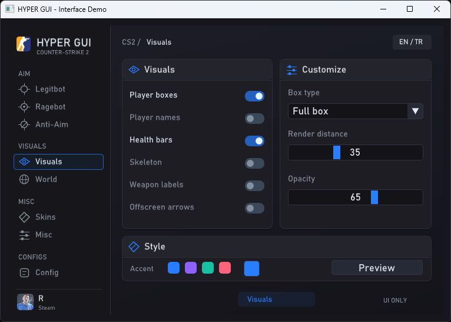
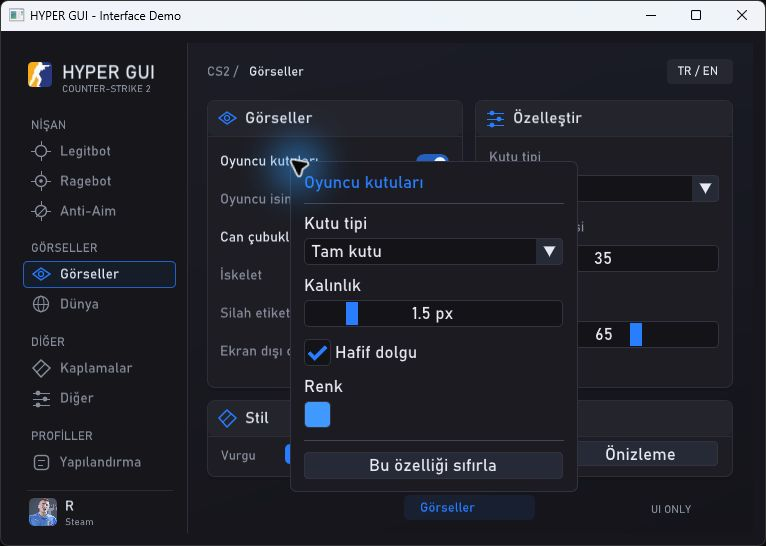

# HYPER GUI

[English](#english) · [Türkçe](#türkçe)




## English

A Counter-Strike 2 themed menu written in C++17 with Dear ImGui. Run the Windows demo or add the UI files to an existing ImGui project.

**GUI only.** There are no working cheats or game connections. The controls update local settings; the player preview is an illustration.

### Features

- 740 × 490 layout, icon navigation, Bahnschrift font and selectable accent colors.
- Legitbot, Ragebot, Anti-Aim, Visuals, World, Skins, Misc and Config pages.
- Right-click a feature to change its own settings: color, thickness, placement, activation mode and key selection.
- Optional player illustration showing visual settings.
- English and Turkish language switch.
- Three session profiles, including per-feature settings. Profiles are kept in memory and cleared when the demo closes.
- CS2 app icon and automatic local Steam profile name/avatar in the standalone demo.

### Build and run

Requires Windows, Visual Studio 2022 with **Desktop development with C++**, the Windows SDK and CMake 3.20 or newer.

```powershell
cmake -S . -B build -A x64
cmake --build build --config Release
.\build\Release\hyper_demo.exe
```

Dear ImGui v1.91.9b is included in `vendor/imgui`. No dependency download is needed. The demo uses the Bahnschrift font installed with Windows; the font itself is not distributed here.

### Steam profile

The demo locates Steam through the current user's registry settings. It reads display names from `config/loginusers.vdf` and avatar images from `config/avatarcache`. It selects the active account when available, otherwise the most recent locally saved account. It checks for changes every ten seconds.

No API key or internet connection is required. The account and avatar must already be cached by Steam on this PC. Missing avatars use a Steam placeholder. This is a cached profile, not an online-status indicator. Profile data is read at runtime and is not embedded in the executable.

### Integration

Add `src/hyper_gui.cpp` and `src/hyper_gui.hpp` to your existing Dear ImGui project. Keep one copy of ImGui core and use the platform/renderer backends already used by your application.

```cpp
#include "hyper_gui.hpp"

hypergui::State menu;

// In your frame loop, after the backend NewFrame calls:
ImGui::NewFrame();
hypergui::Render(menu);
ImGui::Render();
// Submit ImGui::GetDrawData() through your renderer.
```

Keep `menu` alive between frames. The host owns the ImGui context, fonts, input, graphics device and render thread. `menu.settings` holds the UI values. Load a font that includes Turkish glyphs. The component restores the host's style after drawing.

Optional `menu.cs2Icon` and `menu.steamAvatar` texture IDs are owned by the host. Set `menu.steamName` to the display name. The Windows demo's `demo/steam_profile.hpp` supplies these automatically using WIC and DirectX 11. A different renderer should provide its own texture loading.

For CMake integration, set `HYPER_BUILD_DEMO=OFF` and `HYPER_IMGUI_DIR` to your Dear ImGui directory, then use `add_subdirectory` and link `hyper_gui` alongside your existing ImGui target. For a DLL-based project, compile the component into the host and call it from the normal render loop with the correct ImGui context. Compiler settings, runtime and ImGui configuration must match the host.

You can hide the menu by making the 'Render()' call conditional.

### Tests

```powershell
cmake -S . -B build -DHYPER_BUILD_TESTS=ON
cmake --build build --config Release
ctest --test-dir build -C Release --output-on-failure
```

### License and credits

HYPER GUI source is MIT licensed. Dear ImGui and the adapted Win32/DirectX 11 example are copyright Omar Cornut and contributors; see [their license](vendor/imgui/LICENSE.txt). The CS2 icon and Counter-Strike/Steam marks belong to Valve and are not covered by this project's MIT license. See [asset credits](assets/NOTICE.md).

## Türkçe

C++17 ve Dear ImGui kullanan Counter-Strike 2 temalı bir menü. Windows demosunu çalıştırabilir veya arayüz dosyalarını mevcut ImGui projenize ekleyebilirsiniz.

**Yalnızca GUI.** Çalışan hile veya oyun bağlantısı içermez. Kontroller yerel ayarları değiştirir; oyuncu önizlemesi bir çizimdir.

### Özellikler

- 740 × 490 düzen, ikonlu gezinme, Bahnschrift font ve seçilebilir vurgu renkleri.
- Legitbot, Ragebot, Anti-Aim, Görseller, Dünya, Kaplamalar, Diğer ve Yapılandırma sekmeleri.
- Özelliğe sağ tıklayarak renk, kalınlık, konum, etkinleştirme biçimi ve tuş seçimi gibi ayarları düzenleme.
- Görsel ayarlarını gösteren isteğe bağlı oyuncu illüstrasyonu.
- Türkçe ve İngilizce dil geçişi.
- Özellik ayarlarını da saklayan üç oturum profili. Kayıtlar bellekte tutulur ve demo kapanınca silinir.
- Bağımsız demoda CS2 simgesi ve otomatik yerel Steam profil adı/avatarı.

### Derleme ve çalıştırma

Windows, **C++ ile masaüstü geliştirme** bileşeni kurulmuş Visual Studio 2022, Windows SDK ve CMake 3.20 veya üzeri gerekir.

```powershell
cmake -S . -B build -A x64
cmake --build build --config Release
.\build\Release\hyper_demo.exe
```

Dear ImGui v1.91.9b, `vendor/imgui` klasörüne dahildir. Bağımlılık indirmek gerekmez. Demo Windows ile gelen Bahnschrift fontunu kullanır; font dosyası bu projede dağıtılmaz.

### Steam profili

Demo, Steam klasörünü mevcut kullanıcının kayıt defteri ayarlarından bulur. Görünen adları `config/loginusers.vdf`, avatarları `config/avatarcache` üzerinden okur. Varsa etkin hesabı, yoksa yerelde kayıtlı en son hesabı seçer. Değişiklikleri on saniyede bir kontrol eder.

API anahtarı veya internet bağlantısı gerekmez. Hesap ve avatarın bu bilgisayarda Steam tarafından önceden saklanmış olması gerekir. Avatar yoksa Steam simgesi gösterilir. Bu alan çevrimiçi durumu göstermez; kayıtlı profili gösterir. Profil bilgileri çalışma anında okunur, uygulama dosyasına gömülmez.

### Mevcut projeye ekleme

`src/hyper_gui.cpp` ve `src/hyper_gui.hpp` dosyalarını mevcut Dear ImGui projenize ekleyin. ImGui çekirdeğini ikinci kez derlemeyin; uygulamanızın mevcut platform ve çizici backend'lerini kullanın.

```cpp
#include "hyper_gui.hpp"

hypergui::State menu;

// Kare döngüsünde, backend NewFrame çağrılarından sonra:
ImGui::NewFrame();
hypergui::Render(menu);
ImGui::Render();
// ImGui::GetDrawData() verisini kendi çizicinizle ekrana aktarın.
```

`menu` nesnesini kareler arasında koruyun. ImGui bağlamı, fontlar, girdiler, grafik aygıtı ve çizim iş parçacığı ana uygulamaya aittir. Arayüz değerleri `menu.settings` içinde tutulur. Türkçe karakterleri içeren bir font yükleyin. Bileşen çizimden sonra ana uygulamanın stilini geri yükler.

İsteğe bağlı `menu.cs2Icon` ve `menu.steamAvatar` doku kimliklerinin sahibi ana uygulamadır. Görünen adı `menu.steamName` alanına atayın. Windows demosundaki `demo/steam_profile.hpp`, WIC ve DirectX 11 kullanarak bu alanları otomatik doldurur. Farklı bir çizicide doku yüklemesini ana uygulama sağlamalıdır.

CMake ile eklemek için `HYPER_BUILD_DEMO=OFF` yapın, `HYPER_IMGUI_DIR` değerini kendi Dear ImGui klasörünüze ayarlayın; ardından `add_subdirectory` kullanıp `hyper_gui` ve mevcut ImGui hedefinizi bağlayın. DLL tabanlı bir projede bileşeni ana projeyle birlikte derleyin ve doğru ImGui bağlamıyla normal çizim döngüsünden çağırın. Derleyici ayarları, çalışma zamanı ve ImGui yapılandırması ana projeyle eşleşmelidir.

'Render()' çağrısını koşula bağlayarak menüyü gizleyebilirsin

### Testler

```powershell
cmake -S . -B build -DHYPER_BUILD_TESTS=ON
cmake --build build --config Release
ctest --test-dir build -C Release --output-on-failure
```

### Lisans ve kaynaklar

HYPER GUI kaynak kodu MIT lisanslıdır. Dear ImGui ve uyarlanan Win32/DirectX 11 örneğinin telif hakkı Omar Cornut ve katkıda bulunanlara aittir; [lisanslarına bakın](vendor/imgui/LICENSE.txt). CS2 simgesi ve Counter-Strike/Steam markaları Valve'a aittir, projenin MIT lisansı kapsamında değildir. Ayrıntılar [görsel kaynakları](assets/NOTICE.md) dosyasındadır.
